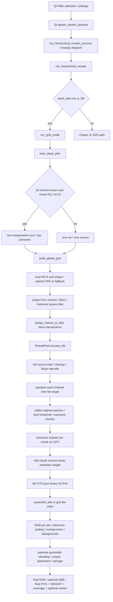

# ZM-ZEGRID-R0 — Archaeology & Architecture Freeze

**Owner: Junior. Date: 2026-10-05. R0 STATUS: ACCEPT CANDIDATE — Junior technical acceptance + Nono ACCEPT; HUMAN GATE pending.**

This is a proposed freeze for human approval, not authorization to implement R1. No new production Grid engine, SCI-05 change, Classic/SDS change, Phase 4.5 cleanup, commit, push, merge, rebase or tag.

## Executive decisions

1. Separate **GlobalCanvas geometry** from **ZeGridLayout policy**. Disjoint Cell cores own output pixels; ProcessingPatch includes computational context. MiniTile means the **whole patch result**, with an explicit core slice. Only the core is placed into the science canvas.
2. Feed aligned local arrays and explicit boolean geometric support directly into `CanonicalStackRequest → run_canonical_stack → CanonicalStackResult`. Do not reuse the legacy Grid chunk-folding or reduce results to science + ALPHA. Preserve canonical support and estimator maps independently.
3. Determinize identities and sequence **before** geometry and canonical calls. Canonical auto-reference then retains its max-valid-support science with stable identity tie-break. This is necessary but not sufficient: do not partition the exposure axis into independently stacked chunks.
4. First Auto hypothesis to benchmark: target cell dimensions proportional to **separate median projected source widths/heights**, choose Nx/Ny under explicit measured memory/support constraints; ratio is a benchmark variable, not a default. No fixed 4×4, FoV fraction or pixel dimension is frozen.
5. R1: one real Cell and one patch, CPU, qualified undistorted TAN and **prepared RGB FITS inputs**; section reads and local reprojection compared with full-source reference reprojection onto the **same patch**, then the identical canonical call. M106 raw Bayer preprocessing is a separately qualified fixture-generation step, not a claim of production local CFA decoding. See P.

Important qualification: canonical local stacks are not generally identical to a full-canvas stack cropped later. Reference, affine normalization, noise/FWHM estimation and exclusions depend on the spatial statistical domain. A finite halo cannot make these global estimators local-invariant. R2 must qualify inter-cell continuity rather than promise it from integer placement alone.

## A. Base and evidence discipline

Repository `/home/tristan/.openclaw/workspace/projects/zemosaic`.

Executed **before source analysis**:

```sh
git fetch origin --prune
git branch --show-current
git rev-parse HEAD
git rev-parse origin/beta
git status --short
```

Observed: branch **beta**; HEAD = origin/beta = **434961a8ec5f6530ea1f427fcc910cacc3f79228**; initial worktree clean. No branch switch or commit. All source locations below refer to this immutable base; added files are outside production paths.

Evidence levels:

- **STATIC**: source inspection, not an end-to-end execution claim.
- **WITNESS**: small executable test of the stated behavior, not full production validation.
- **REAL GEOMETRY**: 66 local Seestar S50 FITS headers/WCS, no pixel stacking.
- **PROPOSED / UNKNOWN**: explicit future contract or unvalidated hypothesis.

Artifacts:

- `tools/zegrid_r0/geometry.py`: header-only simulator, undistorted two-dimensional TAN qualification only.
- `tests/test_zegrid_r0_geometry.py`: targeted geometry and historical witnesses.
- `docs/refactor/zegrid_r0/M106_geometry.json`: manifest (relative names, header hashes, shapes/instruments), exact canvas header, versions, layouts, memberships, coverage statistics, cost estimates.
- `docs/refactor/zegrid_r0/M106_geometry_summary.md`: all twelve measured layout/halo rows.
- `docs/refactor/zegrid_r0/M106_order_witness.json`: real normal/reverse/random results and legacy geometry observation.

Environment: NumPy 2.5.1, Astropy 8.0.1, Reproject 0.21.0, Shapely 2.1.2. Shapely already appears in `pyproject.toml` base dependencies; R0 introduces no dependency. Header hashes identify geometry snapshots, **not complete science-file content hashes**.

## B. Current Grid call graph



Entry locations: `zemosaic_gui_qt.py:562` spawn, `:6122` Filter kwargs; `zemosaic_worker.py:30631` dispatcher, `:30854` Grid branch, `:36325` and `:36510` process invocations. `grid_mode.py:4237` run, `:4509` build, `:4534` assignment, `:4564` ThreadPool, `:4613` assembly.

**Hidden handoff distinction:** Grid detection occurs **before** `_prepare_global_wcs_plan` and downstream Filter/SDS processing (`worker:30899`). `run_grid_mode` receives neither `filtered_header_items` nor `filter_overrides` nor the Filter Global WCS descriptor. It reloads CSV and disk config. Therefore checked Filter items / planned canvas are **not the authoritative Grid membership/canvas** on this branch. Main GUI settings passed explicitly are partly honored; Grid RGB/layout/memory policy can be reread from disk (`grid:4297–4369`). Future overlay must use the very same frozen canvas/membership plan as execution, not assume today's Filter descriptor equals Grid.

Exceptions from Grid are logged and reraised; missing module raises `RuntimeError`, **no Classic fallback** (`worker:30888–30896`). Module-independent detection fallback checks file existence (`worker:707`). The text “fallback to classic?” inside `assemble_tiles` is an obsolete diagnostic, not a fallback call. Some individual tile exceptions are swallowed in the futures loop and assembly can continue with surviving tiles: distinguish whole-mode fail-closed from **partial-output permissiveness**.

## C. Stack plan contract

`grid_mode.py:668`, `:713`, `:781–874`. Exact filename, top-level input directory, mere existence triggers Grid, even empty/invalid CSV. `csv.Sniffer` attempts dialect detection on first 2048 characters; `DictReader` preserves row order. Missing/unresolvable files are skipped with logs. Duplicates are not removed. Paths are resolved; Windows drive/UNC tails and basename fallback are tried in priority order. Ambiguous basename rebasing is routing convenience, not reproducible frame identity.

| Column / aliases actually recognized | PARSED | Active consumption | Scientific status at canonical branch |
|---|---|---|---|
| `file_path`, `filepath`, `file`, `path`, `filename`, `fits`, `raw` | string | path resolution, read, WCS, pixels | USED; selects physical exposure |
| `exposure`, `exp`, `exptime`, `exposure_s` | finite float, default 1 | `_compute_frame_weight` multiplies exposure into legacy weight_map | computed but weight_maps ignored when geometric_support is passed: **INERT scientifically in live canonical route** |
| `bortle`, `bortle_class`, `sky_quality` | optional string | stored on FrameInfo only | INERT |
| `filter`, `band`, `channel` | optional string | stored as filter_name only | INERT; no scientific band segregation |
| `batch_id`, `batch`, `session`, `night` | optional string | stored only | INERT; not chunk membership |
| `order`, `seq`, `sequence`, `index` | int(float), default CSV row index | stored only | INERT; **never sorted/consumed** |
| `mount`, `eqmode`, `mount_mode` | normalized EQ / ALTZ / None | chooses separate runs if all known and mixed | USED FOR ROUTING, indirectly changes science populations |
| other columns | retained transiently in DictReader row only | none | unrecognized / INERT, not UNKNOWN science |

Consumers searched in `grid_mode.py` and repository call sites; production Grid is the FrameInfo owner. `_compute_frame_weight:1685` still runs, may emit a misleading noise_fwhm fallback message, but its weights do not enter `_stack_grid_via_canonical:1914`. Old no-geometric-support helper branches remain callable and do consume legacy weights; do not conflate them with current `process_tile`.

Parser caveats **WITNESS**: `normalized_headers` lowercases/strips a separate list but does not remap row keys: uppercase `PATH` is not recognized. “No headers” fallback is not a robust headerless parser: nonempty first row becomes DictReader fieldnames and may lose the first file. `order` example `[99,0]` preserves file order `[b,a]`. Do not promote these accidents to product requirements; preserve CSV compatibility deliberately with a future explicit adapter.

### Mount

`grid:4377`, `:4638`: only if **every** frame has a known mount and both values occur, partition EQ then ALTZ into `grid_EQ/mosaic_grid.fits` and `grid_ALTZ/mosaic_grid.fits`; each computes its own canvas. One unknown mount disables all segregation. FITS `EQMODE` is not consulted by `load_stack_plan`. Normalizer aliases: EQ/EQUATORIAL/GEM/GERMAN; ALTZ/ALT-AZ/ALT/AZ/ALT-AZM/ALTAZ/ALTITUDE-AZIMUTH. No canonical request mount field, rejection/normalization difference or explanatory scientific proof was found. **Routing fact is proven; original scientific rationale UNKNOWN.** Keep this as explicit compatibility partition policy, outside geometry/science, until Tristan decides otherwise. Do not silently combine the populations or silently drop unknown mounts.

## D. Current global geometry

### Structures

| Current type | Real responsibility | Problem for new engine |
|---|---|---|
| FrameInfo (`grid:448`) | mutable path/CSV metadata + lazily loaded WCS/shape + projected **bbox** | footprint name does not mean polygon/support; mixes provenance and derived geometry |
| GridTile (`:462`) | overlapping bbox, target WCS, mutable frame list, output path | logical ownership, processing region and lifecycle are conflated |
| GridDefinition (`:471`) | global WCS/shape/offset + square tile size + overlap + tile list | canvas and historical policy fused |
| GridModeConfig (`:481`) | science settings + legacy layout/GPU/chunk/output settings | not a future coherent layout/science contract |

### Construction facts

1. `_load_frame_wcs:876` reads primary header **and `.data` with memmap=False**, validates `WCS(header).is_celestial` and scale, derives spatial shape. A 3D array uses its last two dimensions even though loader later accepts HWC as well: HWC shape ambiguity is a static risk. No plate solving in Grid; valid WCS must already exist. Rejects/logs missing WCS; caller relies on populated attributes rather than uniformly honoring loader's boolean return.
2. `_extract_pixel_scale_deg:935` attempts `s.to_value(u.deg)` on `proj_plane_pixel_scales` entries. In this environment they are numeric scalars, so the fallback reads `wcs.cdelt`. For CD-matrix WCS it can be `[1,1]`, ignored by WCS itself but erroneously returned by this helper. **Real M106 + synthetic witness reproduce 1 deg/px vs ≈0.000659 deg/px.** This contaminates target resolution/FoV/tile policy. Shared `zemosaic_utils._compute_pixel_scale_for_wcs:581` already handles numeric scales/CD norms: a useful reusable concept/helper, not a reason to modify shared code now.
3. `build_global_grid:1148` uses median source scale, `find_optimal_celestial_wcs(..., projection='TAN', auto_rotate=True)`. If failure or proposed dimensions are “degenerate” (<256 or <half mean source dims), fallback chooses **first valid source WCS** (`:1023–1091`), strips distortion best effort, projects sources into it, floors/ceils bounds. First source fixes orientation/scale/projection reference of fallback.
4. `_compute_frame_footprint:1094` projects only **four pixel centres** `(0,w-1)×(0,h-1)` then discards polygon and retains min/max. Accepts any finite subset of corners; warnings are logged, not a quality gate. Curved edges/SIP extrema, incomplete corners and image edge-vs-centre half-pixel conventions are not robustly bounded.
5. `_strip_wcs_distortion:992` is best-effort mutation of a deep copy (can fall back to original on copy failure). It attempts SIP/CPDIS/DET2IM/PV removal; not proof that every Astropy distortion attribute is cleared (e.g. numbered lookup attributes). Future code must not silently strip a scientifically meaningful WCS.
6. Normal route **recomputes** global extents from corner bboxes after optimal WCS, replacing optimal shape; footprints translated by offset then integer **round** (not uniformly outward floor/ceil). Fallback also rounds per-frame local bboxes. Invalid footprint sources skipped.
7. Historical tile policy: median **max(h,w) FoV**, scaled by grid_size_factor; square tile size at least 32; overlap clipped 0..0.9; integer step. While-loops create row-major tiles until canvas end, including small trailing tiles. Estimated tile count formula differs from actual edge loop; 50k guard is runtime safety, not product layout policy. Disk default factor is 4.0 despite misleading “image /4” comment: larger means larger/fewer tiles.
8. `_clone_tile_wcs:1132` subtracts **offset + local tile origin** from CRPIX. Canvas WCS itself is **not shifted** to bake offset. Final `assemble_tiles:3958` serializes `grid.global_wcs` directly although tiles were placed in offset-relative coordinates. Static mismatch confirmed by fallback witness and nonzero real offset. M106 legacy header-only build factor=1/overlap=.1 produced shape H×W=3275×2410, offset=(-669,-670), four tiles, helper scale=1. This is an observation of current Grid, **not** the proposed 2403×3278 canvas measurement.

**Decision:** do not reuse `build_global_grid` verbatim. Keep the WCS reprojection primitives; implement a qualified canvas builder separated from layout, bake global offset exactly once, insist final/patch sky coordinates agree. Unsupported/degraded projections fail with explicit reasons; a geometry fallback, if later approved, must choose a stable ranked source and be visible. R1 needs no fallback: small undistorted TAN domain, all boundaries valid.

### The other “Global WCS”

Filter/SDS `zemosaic_utils.compute_global_wcs_descriptor:743` is **different**: RA-wrap-aware footprint sky extents, median/min/max scale, north-up or median PC orientation, percentage padding, optional explicit dimensions; minimum 1-degree angular spans in default dimension calculation. It is not Grid's `find_optimal...auto_rotate` construction and is not authoritative for this early Grid dispatch. Reuse descriptor serialization/UI plumbing with an adapter, not its policy accidentally. No change to SDS/Classic.

### Four distinct notions of coverage

| Object | Available without pixels? | Meaning |
|---|---|---|
| WCS footprint polygon | yes (header/WCS + shape) | projected outer image geometry; exact straight edges for qualified undistorted TAN-to-TAN, otherwise sample/adaptively bound |
| bbox | yes | conservative broad-phase approximation **if** extrema are correctly bounded; current rounded/corner-only bbox need not be conservative |
| reproject footprint / resampled alpha | no for data-invalid/alpha semantics | transform validity / source validity transported onto target; not a frame count |
| positive canonical support | no | pre-rejection `q*m*a`, accumulated W1/W2, N_eff; finite-all-channel validity and active-frame exclusions matter |

bbox↔bbox is O(1), cheap broad phase, false positives near rotations. polygon↔rectangle is the right narrow phase for Cells/Patches; polygon↔polygon useful for actual overlap or irregular ROI but unnecessary as the basic rectangular partition abstraction. Costs grow with vertices; use bbox prefilter/spatial index later if measured. No new geometry package: existing Shapely suffices for witness; no need to require a complex dependency for a four-corner clipper in future core.

**“Covers patch” means nonzero-area geometric intersection**, not covers all patch pixels and not positive scientific support. Border contact alone does not create a contributing exposure. Distorted WCS needs adaptive edge sampling plus conservativeness verification; corners alone are not universal. Simulator rejects unsupported WCS instead of pretending exactness.

## E. Current pixel flow and scientific boundary

`grid:1469–1683` loads full source per frame-per-tile, possibly float64 intermediate then float32, source alpha, channel-axis normalization; Bayer min/max normalization → OpenCV uint16 demosaic → ADU rescaling. `zemosaic_utils.load_and_validate_fits:3933` repairs NaN/Inf to zero when requested by Grid. This can erase original data-invalid semantics before canonical finite masks: do not copy that blindly.

**Correction to the handoff's possible interpretation:** `_reproject_frame_to_tile` already specifies **tile target shape**, not a full-frame-sized reprojected output followed by a crop. It still reads/decodes a full source for each membership, and repeats target WCS mapping per channel. Source ROI optimizes read/decode volume and memory; target coordinate transform cost remains proportional to requested target area. Claimed source-pixel ratios are not runtime speedups.

Alpha issue **WITNESS**: after science reprojection, source alpha is multiplied directly into target footprint without reprojection. Different shapes raise and are silently ignored; equal shapes with different WCS can misalign silently (static). Then `process_tile:2401` converts footprint to **boolean >0**. Fractional alpha magnitude is not a canonical quality weight. Future adapter must transport alpha/validity into target coordinates and respect SCI-05 boolean geometric-support contract; no invented fractional-alpha weighting.

`process_tile:2192`:

- Sequential `tile.frames`; failed reprojection skipped. First successful patch defines byte estimate/chunk size; cap 256 when N>256.
- Builds legacy scalar weight_map (including exposure) but canonical entry uses only patches and explicit bool footprints, not these weight_maps.
- Each `flush_chunk` calls canonical wrapper (CPU even through GPU-named wrapper), returns only science/float32 estimator weights/reference_median passthrough. The median anchor is not a new canonical normalization context.
- Folds `stacked_chunk * weight_sum`, sums, divides. **Not equivalent to a single canonical call over all exposures** for median/rejection/normalization/normalized quality weights. `NaN*0` can also poison accumulated pixels before final nonfinite→zero cleanup (static risk, not separately probed).
- Binary ALPHA derives from running estimator >0; saves tile science. Canonical W1/W2/N_eff/rejection provenance are discarded by wrapper, not written into tile output.

### Exact ZeGrid → SCI-05 entry

`core/canonical_engine.py:100`, `:149`, `:199`; `canonical_stacking.py:545`, `:631`, `:719`, `:1051`; `canonical_support.py:99`, `:366`.

Supply:

- Ordered sequence of uniformly shaped **HW mono OR HWC1/HWC3 float32 aligned arrays** on the patch WCS (no mixed mono/RGB shape guess).
- Matching sequence of **2D bool geometric_support**; engine combines with finite-all-channels validity. Preserve invalid source values; no zero-derived validity.
- Existing normalization, weighting, rejection, combine tokens/parameters, explicit backend, taper config. Proposed caller sets `reference_index=None` **after stable identity ordering**, not arbitrary first patch. Do not reproduce reference ranking in a second science implementation.
- Default canonical taper `footprint`, 8 target px/floor 0 is an **existing SCI-05 parameter**, not a new fixed ZeGrid halo. Explicit maps are also supported, but R1 need not implement a parallel taper algorithm.
- No WCS, crop, mount, exposure, cell ID field exists in the canonical request; geometry remains adapter-owned provenance.

Keep full result semantics: science float32; channel-shaped float64 estimator sum; 2D float64 SUP_W1/SUP_W2/N_eff; valid mask/count/rejection diagnostics + reference/exclusion provenance. Mean estimator sum differs from median survivor count and from positive support. Support accumulates **before rejection**. Avoid inferring/support summing from ALPHA or re-stacking MiniTiles as exposures. All-N includes every original contributor for a cell, not per-chunk summary images.

`canonical_equalize.py:90` is the only future scientific equalizer; engine `equalize_rgb=True` is wired despite stale early-gate module commentary. R1 disables per-patch equalization explicitly to isolate spatial stacking; eventual final RGB policy must be canonical and explicit. `canonical_render.py:49/108` is display-only; requires N_eff and must not modify science/support. Neither belongs in geometry or membership.

## F. Order dependencies — complete inspected-chain inventory

“Observable” below means a tested witness or direct executed branch fact, not a whole scientific production run.

| Location | Dependency/type | Effect; evidence | Determinization strategy |
|---|---|---|---|
| load_stack_plan:821–870 | CSV row iteration; order field inert; duplicate rows retained | membership list and later numerical/scientific order; WITNESS | stable immutable frame IDs, reject ambiguous duplicates; preserve explicit multiplicity only if specified |
| _resolve_path:721–771 | first existing candidate / basename relocation | source selection depends on filesystem presence, not list permutation; STATIC | manifest identities and resolved origin, fail on ambiguity |
| build_global_grid:1160–1210 | input sequence into optimal WCS/reductions/auto-rotation library | numerical tie / degenerate-angle possibility; UNKNOWN magnitude in old optimal path | canonical sorted sequence, frozen library/policy versions; explicit orientation tie contract |
| _pick_first_valid_frame:1023 / fallback:1037 | first valid source WCS | geometry orientation/scale/centre; STATIC and fallback WITNESS | no implicit fallback in R1; later stable-ranked fallback, provenance |
| footprint rounding:1302–1340 | floor/ceil/round near integer boundaries after numerical perturbations | shape/membership can flip at boundaries; STATIC risk | uniform pixel-edge convention, outward bounds, deterministic ops; no arbitrary epsilon silently trimming data |
| assign_frames_to_tiles:1456 | append in input order; inclusive bbox touching | patch list order / broad-phase false positives; STATIC + geometry WITNESS | geometric narrow phase + sorted immutable membership |
| _reproject / process_tile:2370 | first successful frame after skips | actual first patch/reference/chunk allocation; STATIC | ordered outcomes, deterministic failure policy, no success-completion-derived anchor |
| _stack_grid_via_canonical:1936 | explicit reference 0 unless first support empty | normalization/quality/exclusion decisions; WITNESS for underlying reference behavior | sorted identity order then canonical auto max valid support |
| canonical_stacking:631 | `np.argmax(valid_counts)` first tie | auto None **alone does not solve permutation**; affine-output WITNESS | sort canonical input; record reference **ID** as well as index |
| process_tile.flush_chunk:2266–2411 | contiguous exposure chunks; byte budget; first patch; limit≤256 | rejection low-N/statistics, per-chunk q normalization/reference, median fold; median WITNESS 51 vs 50.5 | one all-exposure canonical request for R1; memory fail explicitly, no scientific exposure splitting |
| canonical_engine:274 and canonical combine/reject reductions | sequential float64 support add / backend reductions | floating order non-associativity; theoretical numeric, backend-specific | fixed frame sequence/backend; compare same-build exact reference/masks + defined science tolerances |
| _normalize_patches:1821 / GPU:1874 | patches[0] in old no-support branch | historical API callers only, **not live process_tile branch** | do not reuse / remove only in separate mission |
| run_grid_mode futures:4580 | completion order | progress/log order changes; outputs assigned to stable tile objects; **assembly still grid.tiles order**, not futures order | index events by Cell ID, immutable results; no claim of healthy-path science permutation here |
| shared gpu_runtime_state:4409 etc. | unsynchronized failure count/disable across threads | failure-path backend scheduling/logs can depend on completion; canonical stack presently CPU on both routes | R1 sequential CPU, explicit errors; parallelism separate mission |
| assemble_tiles:3194 etc. | first readable channel count; later target_channels chooses RGB if any | first determines mismatch diagnostics; usually not final channel policy; STATIC | manifest channel contract, reject unsupported mixed input |
| assemble reference:3363 | first valid nonconstant tile | photometric anchor; order observable from branch, no real permutation image run | don't inherit; stable contract if proven necessary later |
| _solve_global_gain_offset:2797 | argmax degree tie uses tile list index | photometric gauge anchor; iterative float32 sum order; STATIC | stable Cell ID ties if retained, experiment before reuse |
| build_tile_overlap_graph:2676 / blending:3682 | pair orientation and pair addition order, redundant triple overlaps | regression direction, numerics and pairwise overlapping science; STATIC | disjoint core placement first; no pairwise aggregate science from overlapping halo |
| background harmonization / metrics:3584–3672 | floating reductions of tile arrays | backgrounds, diagnostic std; median mostly permutation-invariant, reductions finite precision | fixed IDs; do not classify all medians as arbitrary first-element dependencies |
| final placement:3734 | tile list order in sums / missing tile set | numerical overlaps and holes if failures; STATIC | exactly one cell owner; mark incomplete not success on missing nonempty cell |
| filesystem traversal / Phase-1 as_completed in worker | downstream non-Grid code | **not traversed by early Grid return**; not a Grid dependency just because it exists | don't refactor Classic/SDS based on this audit |

### Proposed reproducibility contract

- A manifest-scoped `FrameId`: Unicode-normalized POSIX **relative logical path**, case preserved; root relocation does not change ID. Resolve symlink/path aliases and fail on duplicate physical exposure or ambiguous IDs unless multiplicity is explicitly declared. Header/shape fingerprint freezes geometry; execution records complete input checksums when available. Ordering uses this ID, never CSV `order`, Python hash or inode enumeration. Mixed mounts partition **before** canvas with stable partition IDs.
- `CanvasId` hashes versioned canonical WCS+shape+geometry policy+manifest geometry fingerprint. No timestamp in identity. WCS stored as an immutable serialized snapshot; Astropy objects are private decoded copies, never shared mutable globals.
- Cell IDs `(layout_id, row, column)`; row-major zero origin. Edges `floor(i*W/Nx)` / `floor(j*H/Ny)` give exhaustive integer half-open partitions. Patch origin and source crop coordinates have distinct types.
- Membership sorted by FrameId; canonical `None` selects greatest pre-normalization **finite/all-channel** support, ties stable by ID. Geometry-only count cannot predict reference; log chosen ID after canonical output. A reference-quality failure remains an explicit SCI-05 failure, not a silent switch to another normalization/reference method.
- Reprojection/crop bounds computed in fixed float64 operation order; integer outward bounds; versions/flags fixed. TAN qualification and domain failures explicit. No first-success canvas/reference recovery.
- R1 processing sequential, one Cell; later scheduling may vary, but result slots indexed by Cell ID. Assembly write slices fixed/nonoverlapping; no sum of halo contributions.
- Exact equalities in same-build permutation tests: canvas serialization/shape, layout IDs, memberships, source ROI plans, reference IDs, exclusions, masks/counts. Candidate science tolerance for local-vs-full-source same-patch float32 reprojection: `rtol=1e-6`, `atol=1e-4` ADU on valid samples, WCS mapping ≤1e-6 source pixel; **measure and justify before accept, never relax silently**. Canonical outputs for bit-identical aligned arrays must be identical to direct engine. Support W1/W2 requires tight float64 tolerance (proposed rtol=1e-12, atol=1e-12 when inputs identical), not merely matching N_eff. Cross-library/CPU-GPU bitwise identity is not claimed.

## G. Reusable versus legacy; assembly classification

| Piece | Disposition | Reason / assembly class |
|---|---|---|
| SCI-05 request/engine/result/support/taper/reject/combine | KEEP | science authority; **A necessary** |
| WCS library transforms / `find_optimal_celestial_wcs` | ADAPT | geometry primitive with sorted input, correct scale, qualified domain |
| existing numeric scale helper, descriptor serialization | ADAPT | useful plumbing; no SDS geometry-policy reuse by accident |
| CSV route compatibility / mount policy | ADAPT | preserve explicit routing, don't confuse metadata with science |
| build_global_grid / GridDefinition | REPLACE for new route | combines policy with canvas; scale/offset/corner defects |
| bbox broad phase | KEEP concept / ADAPT implementation | efficient prefilter, never final truth |
| _clone_tile_wcs CRPIX offset concept | ADAPT | new canvas normalized once; immutable source WCS; no distortion stripping |
| full source loader for every membership | REPLACE in execution | local reads, validity/scaling/CFA qualification needed |
| _reproject_frame_to_tile | ADAPT primitives, not function verbatim | target-local already; alpha bug / full decode / channels loops |
| legacy exposure/variance weight helper / old normalization branches | DROP LATER from future path | canonical duplicates; do not remove from production in R0 |
| exposure-axis chunk stacking + weighted median fold | REPLACE | scientific population changes; no reuse as memory solution |
| tile FITS ALPHA-only boundary | REPLACE | must retain canonical science/estimator/support/provenance |
| overlap graph / regression utilities | B potentially reusable, D qualify | possible seam **diagnostic**; not necessarily science assembly |
| first-reference scaling, global gains/offsets, background harmonization | C historical architecture + D experimental | local estimators can still disagree; removing all photometry is **not yet proven safe** |
| pairwise pyramidal blending of big overlaps | C historical | disjoint Cell ownership avoids duplicate science; any final boundary operator needs independent scientific justification |
| integer placement without final reprojection | KEEP concept / A | already present; make exact core ownership explicit |
| compute_valid_mask abs(data)>eps / salvage assembly | DROP LATER for new path | cannot replace canonical validity with brightness or silently salvage incomplete science |
| old per-tile RGB equalization (unconditional in assembly) + final equalizer | REPLACE future call sites with canonical boundary; A when requested / D scope | current helper is in `zemosaic_align_stack`, canonical file must remain sole future science authority; don't inherit repeated per-tile adjustments |
| final Grid DBE | D requalify, E for R1 | operates on final image, optional strength; no reason to put into local stacking or size science halo from it |
| coverage preview render | B presentation only | use canonical N_eff, never synthesize from overlap blend WEIGHT |
| progress / telemetry / FITS serialization / Qt LineCollection | B plumbing | adapt metadata/shape; not science reuse |
| GPU concurrency / resource scheduling | E for R0/R1 implementation | archaeology only; no parallel architecture here |

Current assembly (`grid:3072–4066`) really does: load ALPHA + brightness mask; RGB equalize each color tile even if final grid_rgb_equalize is false; select first-signal reference scaling; pairwise fits/degree anchor; subtract tile backgrounds toward median; blend overlaps with pyramid; add unique valid areas; salvage if all weights empty; divide; final RGB if enabled; DBE if enabled; write FITS/WEIGHT + coverage (channel-summed **assembly** weights), optional viewer. No canonical support accumulation survives this chain. Therefore “Grid now calls canonical stack” does not imply every post-stack operation already represents the new desired science contract.

## H. Proposed minimal data model / ownership

All bounds below named fields `x0,y0,x1,y1`, integer half-open pixel **indices**; geometric polygon edges are x0−0.5 etc. Never reuse ambiguous current tuple order `(xmin,xmax,ymin,ymax)` across domains.

| Type | Owned fields / responsibility | Excluded fields | Coordinates; mutability |
|---|---|---|---|
| FrameDescriptor | FrameId, source path/format/HDU/axis layout, shape, WCS snapshot, geometry fingerprint, routing provenance | decoded pixels, scientific q, mutable patch footprint | source pixels + sky; immutable manifest |
| GlobalCanvas | CanvasId, WCS snapshot, width/height, explicit centre/edge convention, geometry-policy version | Nx/Ny, tile size, overlap, mount routing, science | normalized global pixels ↔ sky; immutable |
| ZeGridLayout | LayoutId/CanvasId, Nx/Ny, integer edge arrays, halo-spec version, generation parameters | pixels, normalization, source file order | global indices; immutable |
| ZeGridCell | CellId/CanvasId/LayoutId, row/column, **core_global_bounds** | halo, read buffer, support stats | global indices; immutable |
| ProcessingPatch | CellId, **patch_global_bounds**, patch WCS snapshot, `core_slice_in_patch`, halo requested/applied per side | source crop bounds, final image ownership | global ↔ local patch pixels; immutable geometry |
| CellMembership | CellId, sorted core contributor IDs and sorted patch candidate IDs, intersection geometry/qualification provenance | weights, valid sample counts inferred from header | geometric candidates only; immutable |
| SourceCropPlan (necessary extra boundary) | FrameId/PatchId, **source_bounds**, source WCS-slice/axis contract, interpolation + decode margin, read strategy | Cell ownership, stack/reference methods | source pixels ↔ patch; immutable |
| MiniTileGeometry | CanvasId/CellId/PatchId, patch bounds/WCS, core slice, science-policy/manifest fingerprint | arrays, merged per-frame metadata bag | patch local ↔ global; immutable |
| MiniTileResult | MiniTileGeometry + canonical result/provenance; failure/completion state stored separately | independent normalization/weights; overlap-science combine | arrays owned by execution; treat read-only once complete |

**MiniTile = full ProcessingPatch science result.** Core extraction returns a view/copy of every science/support plane with the exact same crop; caller cannot accidentally place patch at core origin. Keep halo result temporarily for seam diagnostics, never count it twice in final support. A future lean serializer may persist only core + metadata but must declare representation explicitly.

Astropy WCS and NumPy arrays are mutable even inside frozen dataclasses: freeze **ownership/API**, serialize snapshots, return private WCS copies. Diagnostic dataclasses in `tools/` are a prototype, not the production immutability implementation.

### Proposed module boundaries (not created under src)

- `core/zegrid/geometry.py`: manifest geometry, canvas, layout, intersections, source crop planning; no image I/O except separate header adapter, no Qt or canonical algorithms.
- `core/zegrid/execution.py`: section reads/decode, local WCS reprojection, build ordered aligned arrays/support; bounded CPU runner first.
- `core/zegrid/science_adapter.py`: thin request/result/provenance adapter only. Imports canonical engine; **no copied science**.
- `core/zegrid/assembly.py`: crop planes, write disjoint cores, validate complete coverage ownership. Future explicitly reviewed boundary correction if needed.
- Existing Qt Filter and a presentation adapter: consume frozen geometry/results; no independent layout builder.
- Routing/config layer above these chooses compatibility mount partitions and SCI-05 settings; no change to Classic/SDS dispatch in R0.

## I. Local reprojection plan

1. Freeze target patch WCS: canvas CRPIX shifted by patch origin (canvas offset already baked). Pixel centre `(x,y)` maps exactly to canvas `(x+patch.x0,y+patch.y0)`.
2. Broad-phase candidate source bbox; narrow-phase source polygon ∩ patch pixel-edge rectangle. **Core-only membership must not be used to exclude halo contributors**. Nonempty halo with empty Cell may support diagnostics, but no final core data is invented.
3. Qualified TAN-to-TAN, no distortion: edge maps are projective straight lines within a common valid hemisphere. Inverse-map intersection polygon vertices to source pixels, outward integer bounds, add **source-pixel** interpolation margin, clip to source bounds. For curved/distorted transforms: adaptively sample boundaries/interior as needed, verify extrema/error envelope or fail qualification. Four corners without such qualification are not sufficient. No guessed global safety margin substitutes for proof.
4. Read `hdu.section[y0:y1,x0:x1]` (axis-aware for color) or true memmap-backed slice, then copy only necessary rectangle. Keep HDU open while section is acquired. Respect BSCALE/BZERO/unsigned storage and compressed-image tile behavior. `.data` followed by slicing and memmap=False is not local I/O. Compressed FITS can decompress larger tiles, so logical pixel count ≠ physical bytes. For R1 use uncompressed prepared RGB and prove section access with instrumentation.
5. WCS of sliced source: prefer qualified WCS slicing (`WCS.slice` / equivalent exact CRPIX shift for undistorted 2D), not manual distortion removal. Reproject cropped channels to exact patch shape with explicit interpolation/order and validity convention. Track original source-boundary domain so clipped crops never create false extra validity.
6. Source ALPHA / geometric validity must be sampled through the **same transform** with an explicit mask interpolation rule, conservatively combined with reproject support; retain finite-invalid data until canonical preparation. For first R1 prepared inputs, absent ALPHA = explicit geometric full source domain, not brightness test. Alpha-bearing/CFA-invalid interpolation needs its own fixture and accepted semantics before enabling.
7. Make canonical request once with all patch contributors in stable order. If memory insufficient, fail with the required working-set estimate. Do not reintroduce old N-chunks. A later exact multi-pass canonical API may be needed; R0 does not redesign SCI-05.
8. Preserve result planes, reference ID, exclusion list and ROI plans. Compare **same patch** full-source vs local-source projection for every requested target pixel, including edges, then canonical outputs. Crop to Cell only after stack/support computation.

### Hidden CFA/data-preparation constraint

`grid:1515–1561`, `utils:4258`: raw Bayer is normalized using **full-frame min/max**, quantized uint16 for OpenCV, demosaiced and rescaled. Crop-local min/max changes quantization, so “just crop then call same helper” is **not proved equivalent**. Source crop origin also changes Bayer phase; requires even-origin expansion or correct pattern phase, decode-neighbourhood margin and boundary validity. Existing nonfinite→zero repair is another semantic constraint.

Options: (a) reuse a prepared RGB source cache, generated once through an explicitly chosen shared decoder; (b) global scalar scan/cache for raw decode normalization then local decode with validated phase/margins; (c) a separately authorized decoder contract change. **Recommendation for R1: (a)**, fixture preparation outside local engine and accounted separately. No claim that all raw I/O is already local. Global WCS/header transform work and per-target mapping are irreducible; repeated per-channel geometry may later be cached but GPU redesign is out of scope.

## J. Cell + halo contract

| Need | Space / contract | R0 decision |
|---|---|---|
| local registration | would need stars/context | absent from current WCS-only Grid, **not added** in R1 |
| interpolation kernel + Bayer decode | **source-pixel** ROI margin | separate from output halo; simulator margin=2 is a hypothesis, not universal kernel proof |
| canonical footprint taper | **target-pixel** context | canonical EDT pads array exterior invalid; an artificial patch edge otherwise changes taper inside Cell |
| normalization / noise / FWHM | statistical domain, not finite convolution halo | fixed explicit patch domain; may change q/reference/exclusions between cells; UNKNOWN seam effect |
| boundary blend | target overlap only if approved | no blend halo required for disjoint core placement; preserve diagnostic overlaps, do not implement science blending by default |
| DBE / Coverage rendering | final image/display domains | not part of local science halo; future global display may need own dirty-region context |

Simplest proposed R1 geometry: one target context halo at least `ceil(taper_px)` at **interior** Cell boundaries when taper enabled, plus independently computed source interpolation margin. This is a dependency on the canonical taper parameter, **not** “product halo=8 forever”. At canvas outer edge clipping leaves the legitimate canvas support boundary. The synthetic taper witness proves that a constant valid domain core with sufficient context matches the larger-domain taper; it does **not** prove global normalization/quality equivalence or arbitrary finite-mask behavior after normalization.

R0 benchmark hypotheses h=0,8,32 explicitly contrast no context, current taper radius and a larger context. No blend/registration/photometry magic constant frozen. The proposed R1 h derived from taper is subject to human approval and local-vs-full **same-patch** tests. Support-margin correctness does not by itself settle multi-cell photometric seams.

## K. Auto layout hypothesis

Propose benchmark family `target_width = k * median_projected_width`, `target_height = k * median_projected_height`; `Nx=ceil(canvas.width/target_width)`, `Ny=ceil(canvas.height/target_height)`, capped to positive integer cells. k is a **measured candidate parameter**, not a hard-coded product ratio. The simulator's 4/16/36/64 approximate budgets select `(Nx,Ny)` using ratio `(W/median_width)/(H/median_height)`; rounding gives 2×2, 5×4, 7×5, 9×7 on M106. These are comparison layouts, not the selected Auto result.

Benchmark dimensions: peak all-N working-set prediction, source pixel redundancy/halo overhead, candidate-count distribution, nonempty/low-N cells, canonical exclusion rate/reference stability and boundary residuals on actual pixels later. Geometry alone cannot choose scientifically adequate dimensions for minimum common pixels, noise statistics or FWHM stars. Memory feasibility cannot be fixed by subdividing N. Very elongated/irregular canvases require independent Nx/Ny and skip truly empty cores. Quantized cell dimension changes can change science statistics: version/persist chosen layout and patch policy.

**No Auto winner declared** from header geometry. The 5×4/7×5 measurements are plausible next benchmarks; 9×7 improves full-read comparison denominator but increases repeated local I/O and halo overhead. Optimize actual end-to-end measured constraints, not that ratio alone.

## L. Real geometry simulation

**REAL SEESTAR GEOMETRY WITNESS = PASS (bounded geometry-only).**

- `/home/tristan/M106/lights`: **66 / 66** accepted primary 2D Seestar S50 sources, 1080×1920, Bayer GRBG, undistorted CD TAN. Header audit: all 66 have BITPIX=16, BSCALE=1, BZERO=32768, EQMODE=1. No downloads. No pixel arrays read by simulator; explicit guard test disallows scaled image-data access.
- Proposed canvas **2403×3278**, median projected source bbox **1091.200×1926.268** pixels, geometric union **84.6552%** of canvas. This is one small real mosaic, not a 1000-frame S trajectory/S30/S50 Pro representativeness claim.
- All twelve layout/halo combinations in [measurement table](zegrid_r0/M106_geometry_summary.md). Counts include empty Cells; all widths/heights and areas, Cell/Patch min/median/mean/max, halo overhead, source pixel estimate and redundancy, false-positive bbox memberships are reported.
- For h=8: 2×2 nonempty 4/4, patch mean N=61; 5×4 20/20 mean=35; 7×5 33/35 mean≈28.49; 9×7 60/63 mean≈28.40. The central maximum remains **66** even for smaller cells: spatial subdivision does not guarantee lower N.
- h=8 estimated repeated source pixels: **141,925,856 / 148,561,325 / 151,755,291 / 157,428,583**. Source crop redundancy **1.037 / 1.086 / 1.109 / 1.150**. Finer layouts do not magically reduce total local source reads.
- Hypothetical full-source-read-per-**same-patch-membership** / local crop ratio: **3.565 / 9.771 / 13.623 / 23.564**. Not old production layout work; not target reprojection work; not an execution-time speedup.
- Coverage distribution: exact polygon-union covered-area fractions per Cell summarized in JSON plus an **80×80 sampled** geometric depth histogram. It is not positive support, not finite-science count, and not an exact all-pixel depth raster. Empty Cell counts 0,0,2,3; some halo-only patches become nonempty at h=32.
- Polygon↔rectangle eliminates **17** bbox-only false-positive patch memberships in 9×7/h=8. No area/membership conclusion based on bbox equality alone.
- On real 5×4/h=8, normal/reverse/random(seed42) runs have **exactly identical** canvas/layout/memberships/metrics after stable sorting. This validates simulator determinization, not current Grid scientific output.

Reproduction from repository root:

```sh
.venv/bin/python tools/zegrid_r0/geometry.py \
  --input /home/tristan/M106/lights \
  --output /tmp/M106_geometry.json --halos 0,8,32
.venv/bin/python -m pytest -q tests/test_zegrid_r0_geometry.py \
  tests/test_sci05_gate_f4_grid_route.py tests/test_grid_mode_stack_plan_paths.py
```

Result: **29 passed in 5.24s**. No full suite: src unchanged. Simulator cannot certify distortion, HWC/CHW, compressed source read cost, alpha validity or science. Unsupported files are listed with reasons; zero supported inputs fails; partial acceptance marked PARTIAL. User must supply real FITS headers with valid 2D TAN, shape and data provenance; generic geometry extension requires additional qualification tests, not silent fallback.

## M. Filter Qt and progressive preview insertion points

Filter `_NormalizedItem:1022` already carries centres, WCS and `footprint_radec`; `_ensure_entry_footprint:7469`, `_build_preview_geometry:7577`, `_render_sky_preview_fast:7691`, `LineCollection:7906`, `_update_preview_plot:8531` provide direct insertion without a UX rewrite. `_update_coverage_plot:5362` already renders in descriptor pixel geometry.

Future minimal adapter adds source footprint polylines + canvas outline + Cell polylines/indices, optional **geometric** membership counts. Compute Cell boundary in global pixel-edge coordinates, transform via the **frozen ZeGrid canvas WCS** to sky, unwrap RA around a shared reference (no 359° line across preview), use common renderer limits/inverted RA conventions. Sample edges when projection curvature requires it; rectangles on canvas are not generally axis-aligned rectangles in RA/DEC. Use cached geometry and batch LineCollection; O(Nframes×vertices + Ncells×vertices) conversion and O(Ncells) labels, no pixels or reproject in UI. Large N: sparse labels/LOD and background geometry job using immutable snapshots; no worker-thread canvas mutations.

Risk: cached Filter/SDS descriptor can differ from Grid and its selection/mode; overlay must show actual execution plan or be explicitly marked preview-only. Invalidation key includes checked membership, source header geometry, layout/halo and scale/orientation policy. Don't reuse group outlines as Cell science regions. Cost expectation is algorithmic, not a measured UI FPS claim.

**Progressive preview feasibility: YES geometrically, no implementation.** For MiniTile completion: verify CanvasId/LayoutId/science fingerprint, crop all planes by core_slice, copy into known global rectangle, set completion bit, refresh a decimated dirty rectangle. Persist CellId, patch/core bounds, WCS identity, channels, valid mask/support maps, reference ID/exclusion provenance, completion/failure state. Preview stretch/DBE/final equalization may still change appearance globally; provisional display must not claim final photometric closure. Missing Cells are distinct from covered-but-invalid sky; completion order must not determine output science or stretch policy.

## N. R1/R2 test matrix

| Domain | R1 minimum | R2 / later gate |
|---|---|---|
| Geometry/order | sorted normal/reverse/random same WCS/shape/layout/IDs/membership; real + synthetic rotation/RA wrap; pixel-edge containment | auto-rotation degeneracy ties, distorted/large/wide fields with bounded WCS error |
| Partition | edge/corner halo clipping, elongated canvas, exact one-owner coverage; source/patch/core coordinate conversions | all-cell assembly and missing-cell failure contract |
| Reference | ties and unequal valid support; finite-invalid first frame; same reference **ID**, not just index; quality failure explicit | adjacent patches with differing rankings; normalization domain sensitivity |
| Local reads | instrument no `.data` full reads in execution; sections only; planned vs observed rectangle; BSCALE/BZERO/axes | CFA parity, invalid-mask transport, compressed logical-vs-physical costs, source-cache strategy |
| Reprojection | full source→same patch vs crop source→same patch, every requested valid target pixel; interpolation margin/edge retention; rotated TAN | distortion bounds, alternate kernels, shared mappings/channel optimization |
| Science | direct canonical oracle on bit-identical aligned arrays; none/linear_fit/sky_mean; WSC/kappa/none; mean/median; support, exclusion and low-N semantics | FWHM sparse cells; spatial-domain and multi-cell seam metrics; no local-science duplication |
| N-population | all contributors in one request; memory refusal explicit; no chunk median/rejection substitution | exact bounded-memory canonical execution only in separately approved mission |
| Taper | sufficient context for known masks; taper ON/OFF; physical vs artificial edges; support equal under rejection changes | cross-cell real finite masks after normalization/exclusion; halo sensitivity curves |
| Assembly | preserve science/estimator/W1/W2/N_eff/validity on core crop; exact known placement | no gaps introduced, no halo double science/support, overlap seam residuals, exposure multiplicity audit |
| Color / output | prepared RGB explicit; canonical equalizer off for isolated R1; float SCI preserved | one explicit canonical RGB policy and preview-only render; no repeated per-cell RGB science |
| Routing | no official Grid replacement; no src Classic/SDS changes | mount partition/unknown behavior, CSV/Filter plan compatibility and no silent fallback |

R0 tests characterize historical defects; **do not turn them into future product invariants**. Their names explicitly say legacy. Full production Grid run, local pixel extraction and real pixel seam tests are NOT_RUN in R0 by design.

## O. Risks, open questions, Phase 4.5

| Priority | Risk/question | Status / action |
|---|---|---|
| HIGH | old CD scale + canvas offset/header inconsistency | reproduced; do not reuse old builder; separate legacy repair mission if wanted |
| HIGH | exposure chunking changes canonical population semantics | median witness; future all-N contract; no SCI-05 modification in R0 |
| HIGH | local normalization/quality/reference differ across patches | scientific domain fact; R1 identical-patch oracle, R2 seam gate; no claim halo solves it |
| HIGH | alpha not geometrically transformed / invalid data repaired | alpha witness + loader static proof; new execution adapter must preserve honest validity |
| HIGH | raw Bayer global min/max and phase | direct source proof; prepared RGB qualification fixture recommended for R1, raw local decode still OPEN |
| MEDIUM | max N remains large despite finer cells | M106 all layouts max66; bounded R1 memory budget, don't claim 10k readiness |
| MEDIUM | metadata-mixed filters/exposure/mount | current scientific/routing facts documented; product policy may need a dedicated decision |
| MEDIUM | arbitrary geometry outside undistorted TAN | simulator rejects, no silent WCS stripping; future bounded distortion planner |
| MEDIUM | desired final photometric consistency / RGB policy | local-vs-global estimator domains unresolved; old graph neither mandatory nor safely removable without experiment |
| MEDIUM | stable manifest identity and numeric tolerances across machines | same-build contract proposed, versions pinned in evidence; cross-backend qualification deferred |
| LOW | diagnostics/GPU labels/chunk estimates not actual canonical backend/memory | recorded, no opportunistic cleanup |

**Phase 4.5 impact on this Grid route: NONE OBSERVED.** Grid dispatch returns before shared Classic/SDS paths. No invocation of `_run_shared_phase45_phase5_pipeline` appears in grid_mode; its worker call sites belong to other paths. Shared canonical modules / utilities are dependencies, but no direct Phase 4.5 coupling blocking proposed ZeGrid found. This is not a proof that the helper is dead; it also participates in Phase 5 and is left untouched. No ARCH-01/SCI-07 cleanup.

Classic remains panel-oriented, ZeGrid becomes output-canvas-oriented. No production Classic/SDS behavior has changed; an eventually shared helper change would require a separate explicit non-regression gate.

## P. Recommended R1 — one real Cell, no Nx×Ny executor

**Proposed scope awaiting Tristan, not started.**

1. Use the frozen M106 canvas/manifest; select **Cell `r0000c0000`** of measured 5×4 layout: core `[x0=0,y0=0,x1=480,y1=819)`, h=8 clipped patch `[0,0,488,827)`, core slice `y=0:819,x=0:480`; **5 core candidates, 7 patch candidates** (exact IDs in the geometry JSON). This is the deterministic first nonempty row-major Cell, not a handpicked successful reference. All 7 patch candidates included; scientific exclusions must remain explicit. Verify common-support/working-set feasibility, report failure if not sufficient; do not silently switch cell/data after failure.
2. Prepare an immutable real RGB fixture for those original exposures **once** with an explicitly frozen existing shared decoder contract and matching WCS/validity provenance. Record source→prepared relationships and hashes. This preparation may read full raws; its I/O is **separate and not claimed local**. It is a test-fixture/cache precondition, not a new raw Bayer production engine. If Tristan requires raw CFA section decoding in R1 instead, split off a decoder-parity qualification first; don't conceal it inside this cell mission.
3. Implement only qualified TAN geometry→source section plans→local section reads→patch reprojection→one canonical CPU call→MiniTile plus core extract. Default science test configuration explicit; exercise the accepted method matrix through direct oracle. No global assembly, UI, GPU, parallel scheduling, mass layout executor, SCI-05 algorithm changes or fallback modes.
4. Halo derived from current taper radius for interior context (benchmark setting, no product constant); source margin explicitly tied to chosen interpolation, full-source same-patch oracle verifies adequacy. No registration/blend/DBE in R1.
5. Persist patch science, estimator sum, SUP_W1/SUP_W2/N_eff, valid mask/counts, chosen reference ID/exclusions/provenance, source ROIs and crop-to-Cell geometry. Preserve NaN invalidity. Compare local vs full-source reprojection onto the **same** patch, then canonical science/support; permuted manifests exact geometry/membership/reference/rejection semantics.
6. Acceptance: real MiniTile produced, all contributors accounted, source ROI read/reproject instrumentation proves locality in prepared-source execution, canonical semantics matched within explicit measured tolerances, no source production path changes outside authorized isolated adapter, no silent partial success. No claim of final multi-cell seam quality or production raw-CFA readiness.

After R1, a separate R2 can compare adjacent Cells and decide whether patch-local estimators need an explicitly canonical shared statistical context or a qualified boundary treatment. Existing request API has no injected precomputed normalization/quality context, so that future choice may require a **separate SCI-05 extension mission**, not a ZeGrid clone of its science. Do not front-load this uncertainty into an unbounded R1.

## Human gate / review record

Junior considers archaeology/report/executable witness ready for independent review. Nono is asked to review this base + uncommitted isolated artifacts, **read-only**, focusing on unproven claims, order, bbox/support, local source geometry/CFA, SCI-05 duplication, canvas/layout separation, halo, Classic/SDS and arbitrary Auto assumptions. Verdict required: ACCEPT / ACCEPT WITH FINDINGS / REJECT with HIGH/MEDIUM/LOW.

Review status: **ACCEPT**, Nono `review-0`, durable report `/home/tristan/.openclaw/workspace/.a2a-reports/ZM-ZEGRID-R0.nono.r0.md`. No HIGH/MEDIUM finding against R0 validity. Nono independently reran the 29 tests (29 passed in 5.80s) and all twelve real geometry simulations. Junior compared `/tmp/M106_geometry_nono.json` with the stored JSON: **all fields exactly equal**, no differences. Branch/HEAD/origin/beta unchanged; production diff still empty.

Junior dispositions of LOW/INFO advisories:

- A1 normal-path offset: independently inspected `grid:1295–1340` and final header write `:3958`; mismatch exists in both optimal and fallback paths, already covered by D.7–8 (construction facts 6/8). The “now correctly adjusted for cropping” comment is stale, not evidence of a correction.
- A2 bytecode: `tools/zegrid_r0/__pycache__/geometry.cpython-313.pyc` exists but is **already Git-ignored**, absent from `git status --untracked-files=all`; no cleanup or ignore-policy edit required. Never force-add bytecode.
- A3 approximate call-site line numbers: nonblocking; function names and immutable SHA are authoritative.
- A4 scale API mechanism is environment-qualified to Astropy **8.0.1** as listed in A, not claimed universal across all versions.
- Minor review wording correction: Nono calls the stored JSON a “committed manifest” once; **nothing is committed**. All R0 additions remain untracked local files.

Junior final technical decision: **ACCEPT CANDIDATE / HUMAN_GATE**. No further review iteration warranted for nonblocking LOW/INFO items. No repeated/full tests after documentation-only closure edits. Human approval remains required for architecture, Cell/Patch/Halo, deterministic policy, Auto benchmark family, local reprojection strategy and precise R1 prepared-RGB scope. **Never start R1 automatically.**
